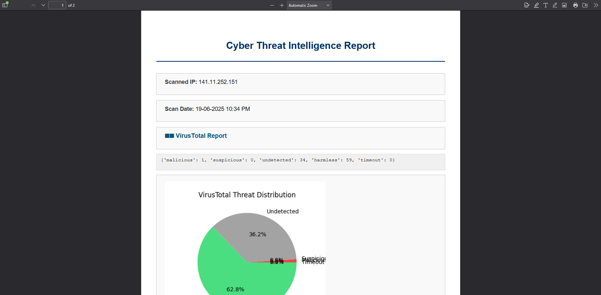

# 🛡️ Cyber Threat Intelligence Dashboard

A Flask + MongoDB powered app to scan and monitor IPs using **VirusTotal** and **AbuseIPDB** APIs.  
Includes scan history, live threat charts, and PDF report exports.

---

## 🚀 Features

- 🔍 IP threat lookup using VirusTotal + AbuseIPDB
- 📊 Live charts (Chart.js + Matplotlib)
- 🧠 MongoDB storage for scan history
- 📄 Export PDF report with embedded charts
- 🌙 Toggle dark/light mode (TailwindCSS UI)
- 🔐 Secure `.env` config for API keys

---

## 📸 Screenshots

### Dashboard UI  


### PDF Report  


---

## 📦 Installation

### 1. Clone the repository

```bash
git clone https://github.com/yourusername/cyber-threat-dashboard.git
cd cyber-threat-dashboard
```

### 2. Create and activate a virtual environment (recommended)

```bash
# Windows
python -m venv venv
venv\Scripts\activate

# macOS/Linux
python3 -m venv venv
source venv/bin/activate
```

### 3. Install dependencies

```bash
pip install -r requirements.txt
```

---

## 🔐 Environment Setup

Create a `.env` file in the root:

```env
MONGO_URI=mongodb+srv://<username>:<password>@<cluster>.mongodb.net/?retryWrites=true&w=majority
VT_API_KEY=your_virustotal_api_key_here
ABUSE_API_KEY=your_abuseipdb_api_key_here
```

---

## ▶️ Run Locally

```bash
python app.py
```

Then go to:
```
http://127.0.0.1:5000
```

---

## 📄 PDF Report Includes

- IP reputation from VT & AbuseIPDB  
- VirusTotal threat distribution (pie chart)  
- Recent Abuse scores (bar chart)  
- Timestamped metadata  
- Exported using `xhtml2pdf`

---

## 🌐 Deployment (Render.com)

1. Push this project to GitHub
2. Add `render.yaml` in root
3. Connect repo to [https://render.com](https://render.com)
4. Add environment variables:
   - `MONGO_URI`
   - `VT_API_KEY`
   - `ABUSE_API_KEY`
5. Click Deploy

---

## 📁 Project Structure

```
cyber-threat-dashboard/
├── app.py
├── requirements.txt
├── render.yaml
├── LICENSE
├── .env.example
│
├── templates/
│   ├── index.html
│   └── report_template.html
├── utils/
│   ├── db.py
│   └── threat_api.py
├── static/
│   ├── vt_chart.png
│   ├── abuse_chart.png
│   └── assets/
│       ├── dashboard_preview.png
│       └── pdf_sample.png
```

---

## 👨‍💻 Author

**Himanshu Choubey**  
GitHub: [@KristovZander](https://github.com/KristovZander)  
Email: choubeyhimanshu719@gmail.com

---

## 📜 License

This project is licensed under the [MIT License](LICENSE)
